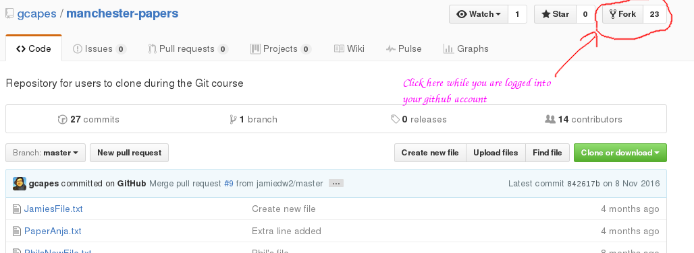

# manchester-papers
Repository for users to clone during git-course

## Forking this repository
You can fork this repository by clicking the `Fork` button, as follows:

## Style guidelines
Please follow the advice on [how to write a good commit message](http://gcapes.github.io/git-course/04-commit-advice/).
